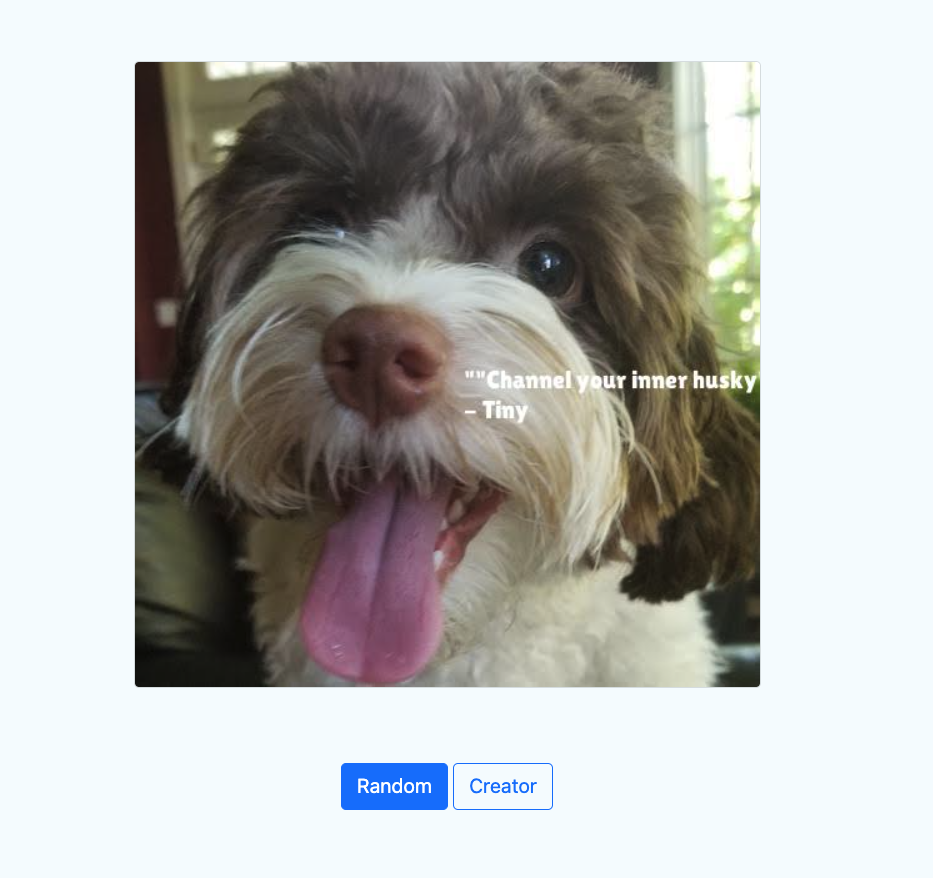
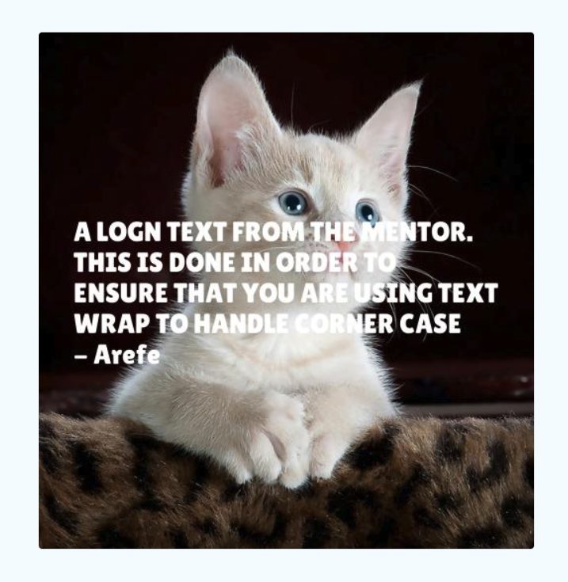

<h1>Meme Generator</h1>
The Meme Generator is a Python project that allows you to generate memes by combining images with quotes. It provides both 
command-line interface (CLI) and web interface (UI) for creating and interacting with memes interactively.




<h2>Project Overview</h2>
The Meme Generator consists of two main modules:

<h3>QuoteEngine</h3>
This module is responsible for ingesting various types of files that contain quotes. It includes classes for parsing quotes 
from different file formats such as CSV, Docx, PDF, and Text files. The quotes are encapsulated in a QuoteModel class.

<h3>MemeEngine</h3>
This module is responsible for generating memes by manipulating images. It includes a MemeEngine class that takes an image, 
resizes it to a specified width while maintaining the aspect ratio, adds a quote to the image, and saves the generated meme.

<h3>Setup and Installation</h3>

To set up and run the Meme Generator project, follow these steps:

1. Clone the project repository and Navigate to the project directory

```shell
git clone git@github.com:Chaklader/UdacityND-MemeGenerator.git

cd UdacityND-MemeGenerator
```

2. Create a virtual environment (optional but recommended) and install project dependencies:

```shell
python3 -m venv .venv
source .venv/bin/activate

pip3 install -r requirements.txt
```

3. Install the required libraries for macOS as provided below. It may require to install similar libraries for the Windows 
and Linux machine. 

```shell
brew install freetype fontconfig poppler
```

<h3>Generate the meme from the CLI</h3>


Activate the virtual environment and enter inside the `src/` directory. Then run the command below: 

```shell
python3 meme.py
```

The program can take three OPTIONAL arguments:

* A string quote body
* A string quote author
* An image path

So, we may also make the request with these arguments`

```shell
python3 meme.py --path "./_data/photos/dog/xander_1.jpg" --body "Hello, Berlin" --author "Arefe"
```

<h3>Generate a meme using the web interface</h3>

The web server can be started from the CLI or IDE and It is recommended to use the CLI for the testing purpose. Enter inside
the `src/` directory and run the command:

```shell
python3 app.py
```

* Open a web browser and navigate to http://localhost:5000 and you should already see an image in the UI
* Click the "Random" button to generate a random meme.
* Create a custom meme after Filling in the form with the image URL, quote body, and quote author  and click the "Create Meme" 
* button to generate the custom meme.


<h3>Corner case</h3>

The UI works fine with the long text as well and it a very long text is provided, it will wrap the text:



License
This project is licensed under the MIT License. See the LICENSE file for more information.


